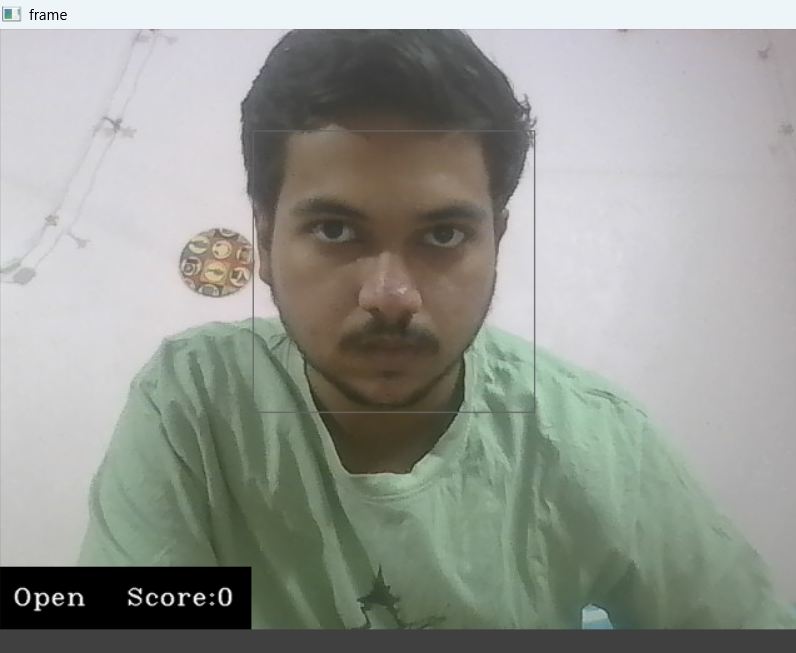
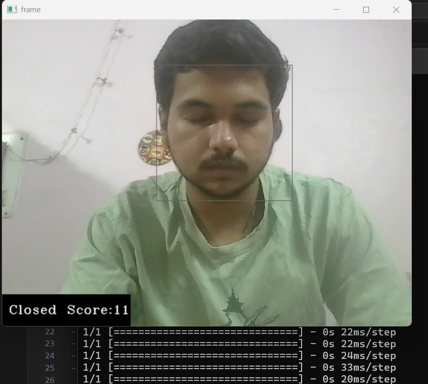
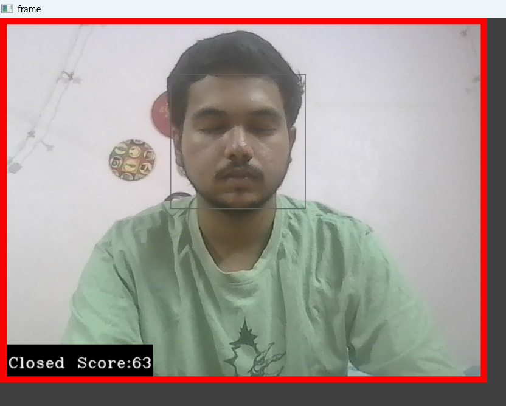

# SAFE_DRIVE_AI🚗💤

A real-time computer vision system that detects driver drowsiness using facial landmarks and eye aspect ratio analysis to prevent accidents caused by drowsy driving.

## 🎯 Overview

This project implements a drowsiness detection system that monitors a driver's eyes in real-time through a camera feed. When signs of drowsiness are detected (eyes closed for extended periods), the system triggers an alert to wake up the driver and prevent potential accidents.


## Demo








## ✨ Features

- **Real-time Detection**: Monitors driver's face and eyes continuously using webcam
- **Eye Aspect Ratio (EAR) Analysis**: Uses facial landmarks to calculate eye openness
- **Configurable Alert System**: Customizable thresholds and alert mechanisms
- **Visual Feedback**: Real-time display of detection status and EAR values
- **Audio Alerts**: Plays alarm sounds when drowsiness is detected
- **Lightweight**: Optimized for real-time performance

## 🛠️ Technologies Used

- **Python 3.7+**
- **OpenCV**: Computer vision and image processing
- **dlib**: Facial landmark detection
- **imutils**: Image processing utilities
- **scipy**: Scientific computing
- **playsound**: Audio alert system
- **NumPy**: Numerical computations

## 📋 Prerequisites

Before running this project, make sure you have Python 3.7+ installed on your system.

## 🚀 Installation

1. **Clone the repository**
   ```bash
   git clone https://github.com/swayxm-20/driver-drowsiness-detection.git
   cd driver-drowsiness-detection
   ```

2. **Create a virtual environment (recommended)**
   ```bash
   python -m venv venv
   source venv/bin/activate  # On Windows: venv\Scripts\activate
   ```

3. **Install required dependencies**
   ```bash
   pip install -r requirements.txt
   ```

4. **Download the facial landmark predictor**
   - Download `shape_predictor_68_face_landmarks.dat` from [dlib's website](http://dlib.net/files/shape_predictor_68_face_landmarks.dat.bz2)
   - Extract and place it in the project root directory

## 📁 Project Structure

```
driver-drowsiness-detection/
│
├── main.py                          # Main application file
├── drowsiness_detection.py          # Core detection logic
├── utils.py                         # Utility functions
├── requirements.txt                 # Python dependencies
├── shape_predictor_68_face_landmarks.dat  # Facial landmark model
├── alarm.wav                        # Alert sound file
├── README.md                        # Project documentation
└── assets/                          # Images and demo files
    ├── demo.gif
    └── screenshots/
```

## 🎮 Usage

1. **Basic Usage**
   ```bash
   python main.py
   ```

2. **With custom parameters**
   ```bash
   python main.py --thresh 0.25 --frame-check 20
   ```

3. **Using external camera**
   ```bash
   python main.py --camera 1
   ```

### Command Line Arguments

- `--thresh`: Eye aspect ratio threshold (default: 0.25)
- `--frame-check`: Number of consecutive frames to check (default: 20)
- `--camera`: Camera index (default: 0 for built-in camera)
- `--alarm`: Path to alarm sound file

## 🔧 How It Works

### 1. Face Detection
The system uses dlib's face detector to locate faces in the camera feed.

### 2. Facial Landmark Detection
68 facial landmarks are identified, with special focus on eye regions (points 37-42 for right eye, 43-48 for left eye).

### 3. Eye Aspect Ratio Calculation
```
EAR = (|p2-p6| + |p3-p5|) / (2 * |p1-p4|)
```
Where p1, p2, ..., p6 are the 6 landmark points of an eye.

### 4. Drowsiness Detection
- Calculate EAR for both eyes
- If EAR falls below threshold for consecutive frames, trigger alert
- Display warning messages and play alarm sound

### 5. Alert System
- Visual alerts on screen
- Audio alarm playback
- Configurable sensitivity settings

## 📊 Configuration

You can modify the following parameters in the code:

```python
# Eye aspect ratio threshold
EYE_AR_THRESH = 0.25

# Number of consecutive frames the eye must be below threshold
EYE_AR_CONSEC_FRAMES = 20

# Alarm sound file path
ALARM_PATH = "alarm.wav"
```

## 🎯 Performance Tips

- **Lighting**: Ensure good lighting conditions for better face detection
- **Camera Position**: Position camera to capture clear view of driver's face
- **Threshold Tuning**: Adjust EAR threshold based on individual eye characteristics
- **Hardware**: Use adequate processing power for real-time performance

## 🔍 Troubleshooting

### Common Issues

1. **Camera not detected**
   - Check camera permissions
   - Try different camera indices (0, 1, 2...)
   - Ensure camera is not being used by other applications

2. **Poor detection accuracy**
   - Improve lighting conditions
   - Adjust camera angle and distance
   - Fine-tune EAR threshold values

3. **Performance issues**
   - Reduce frame resolution
   - Optimize detection parameters
   - Close unnecessary applications

## 🤝 Contributing

Contributions are welcome! Please feel free to submit a Pull Request. For major changes, please open an issue first to discuss what you would like to change.

### Development Setup

1. Fork the repository
2. Create a feature branch (`git checkout -b feature/amazing-feature`)
3. Commit your changes (`git commit -m 'Add amazing feature'`)
4. Push to the branch (`git push origin feature/amazing-feature`)
5. Open a Pull Request

## 📄 License

This project is licensed under the MIT License - see the [LICENSE](LICENSE) file for details.

## 🙏 Acknowledgments

- [dlib](http://dlib.net/) for facial landmark detection
- [OpenCV](https://opencv.org/) for computer vision capabilities
- [Adrian Rosebrock](https://www.pyimagesearch.com/) for drowsiness detection insights
- Research papers on driver fatigue detection

## 📞 Contact

- **Author**: [Your Name]
- **Email**: [your.email@example.com]
- **GitHub**: [@swayxm-20](https://github.com/swayxm-20)
- **Project Link**: [https://github.com/swayxm-20/driver-drowsiness-detection](https://github.com/swayxm-20/driver-drowsiness-detection)

## 🚨 Disclaimer

This system is designed as a safety aid and should not be relied upon as the sole means of preventing drowsy driving. Always ensure you are well-rested before driving and pull over safely if you feel drowsy.

---

⭐ **Star this repository if you found it helpful!**